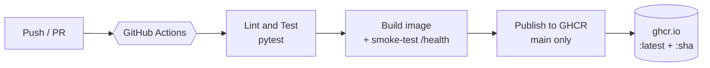
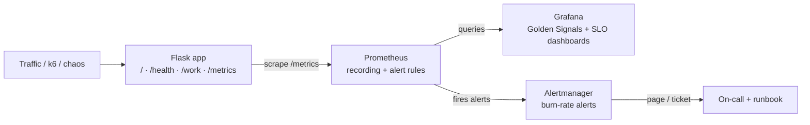
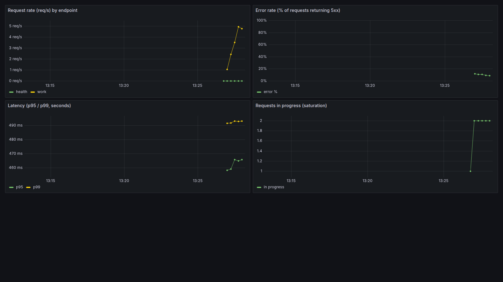
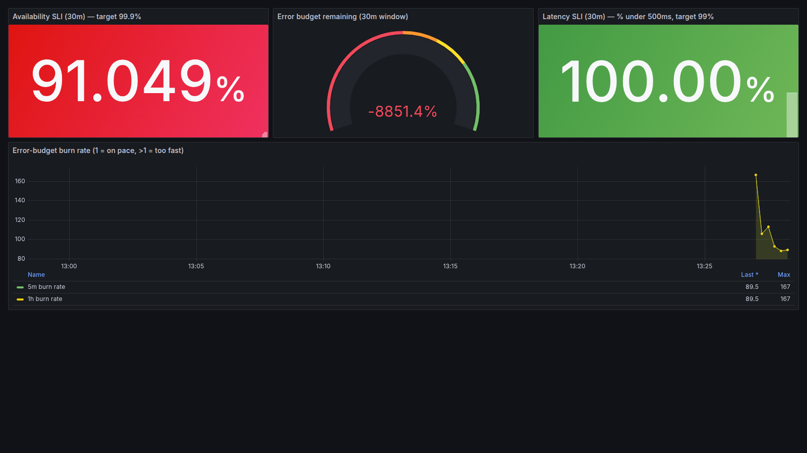
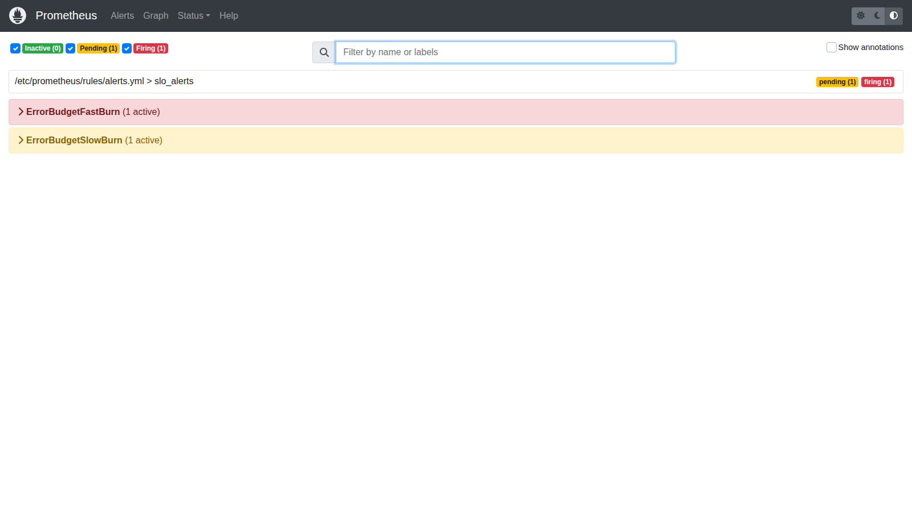

# Project 1 — Reliability Lab

**An SRE reliability lab: SLOs, error budgets, and burn-rate alerting on a fully instrumented service.**

[](https://github.com/sayaksatpathi/reliability-lab/actions/workflows/ci.yml)
[](https://github.com/sayaksatpathi/reliability-lab/pkgs/container/reliability-lab)


[](LICENSE)

A small Flask web service taken all the way from code to a running, **observable,
production-style service** — with tests, containerisation, a GitHub Actions
CI/CD pipeline that publishes to a container registry, and a complete **SRE
Reliability Lab**: metrics, SLOs, error budgets, burn-rate alerting, load
testing, chaos engineering, and incident runbooks.

It's intentionally small so every moving part is visible end to end — a
hands-on tour of how a real service is built, shipped, and *kept reliable*.

### What this project demonstrates

| Area | Skills shown |
|------|--------------|
| **DevOps / CI-CD** | Automated testing, Docker builds, smoke tests, image publishing to GHCR on every merge |
| **Observability** | Prometheus instrumentation (RED method), Grafana dashboards of the four golden signals |
| **Reliability (SRE)** | SLIs, SLOs, **error budgets**, multi-window **burn-rate alerting** (the Google SRE pattern) |
| **Resilience testing** | k6 load testing with pass/fail thresholds; chaos experiments with fault injection |
| **Incident response** | An alert-linked runbook and a blameless postmortem template |

## Architecture

**Delivery pipeline** — every push is tested, built, and (on `main`) published:



**Runtime & observability** — the service exposes metrics that Prometheus
scrapes, Grafana visualises, and Alertmanager pages on:



## What's inside

| File | Purpose |
|------|---------|
| `app.py` | A Flask app with `/`, `/health`, `/work`, and `/metrics` endpoints |
| `test_app.py` | Pytest tests for the endpoints and metrics |
| `requirements.txt` | Runtime dependencies (Flask, prometheus-client) |
| `requirements-dev.txt` | Dev/test dependencies (adds pytest) |
| `Dockerfile` | Builds a container image that runs the app |
| `docker-compose.yml` | The **Reliability Lab**: app + Prometheus + Grafana + Alertmanager |
| `monitoring/` | Prometheus config, recording + alert rules, Grafana dashboards/data source, Alertmanager config |
| `SLO.md` | Service Level Objectives and error-budget definitions |
| `load/` | k6 load test and a chaos-experiment script |
| `docs/` | Incident runbook, blameless postmortem template, and dashboard screenshots |
| `LICENSE` | MIT License |
| `.github/workflows/ci.yml` | CI/CD: runs tests, builds & smoke-tests the image, then publishes it to GHCR |

## Run it locally

```bash
# 1. Create a virtual environment and install deps
python -m venv .venv
source .venv/bin/activate        # Windows: .venv\Scripts\activate
pip install -r requirements-dev.txt

# 2. Run the tests
pytest -v

# 3. Start the app (http://localhost:8080)
python app.py
```

Then open <http://localhost:8080> and <http://localhost:8080/health>.

### The app's endpoints

| Endpoint | What it does |
|----------|--------------|
| `/` | Hello message (JSON) |
| `/health` | Liveness check used by CI and containers |
| `/work` | A simulated workload with variable latency and an occasional 500 — great for making the dashboards interesting. Tune it with `?fail_rate=0.1&max_ms=500`. |
| `/metrics` | Prometheus metrics (request rate, errors, latency, in-flight requests) |

## The Reliability Lab (observability stack)

This is the SRE heart of the project: run your service alongside a full
monitoring stack — **Prometheus** (collects metrics) and **Grafana**
(visualises them) — entirely on your machine, for free.

```bash
docker compose up --build
```

Then open:

| URL | What you'll see |
|-----|-----------------|
| <http://localhost:3000> | **Grafana** — log in with `admin` / `admin`. Two pre-built dashboards: *"Golden Signals — Reliability Lab"* and *"SLO & Error Budget"* (see [`SLO.md`](SLO.md)). |
| <http://localhost:9090> | **Prometheus** — the raw metrics database and query UI. Firing alerts at `/alerts`. |
| <http://localhost:9093> | **Alertmanager** — groups and routes firing alerts. |
| <http://localhost:8080> | The app itself. |

The **Golden Signals** dashboard tracks the four signals every service should
watch — traffic, errors, latency (p95/p99), and saturation:



The **SLO & Error Budget** dashboard turns those into reliability targets —
here captured mid-incident, with availability below target, the error budget
blown, and the burn rate spiking (see [`SLO.md`](SLO.md)):



To see the graphs come alive, generate some traffic (in another terminal):

```bash
# Hammer the /work endpoint for a minute
while true; do curl -s "http://localhost:8080/work?fail_rate=0.1&max_ms=600" > /dev/null; done
```

Stop the stack with `docker compose down`.

### Alerting, load testing & chaos

With the stack running, you can drive the full SRE loop — load, break, get
alerted, recover, document.

**Load test** (with [k6](https://k6.io), via Docker — no install needed):

```bash
docker run --rm -i --add-host=host.docker.internal:host-gateway \
  -e TARGET=http://host.docker.internal:8080 grafana/k6 run - < load/k6-load.js
```

The test has built-in thresholds (<10% errors, p95 < 800ms) and exits non-zero
if they're breached — so it doubles as a release gate.

**Chaos experiment** (break it on purpose and watch the alerts fire):

```bash
./load/chaos.sh                      # 30% errors + latency for 2 minutes
# or: FAIL_RATE=0.5 DURATION=180 ./load/chaos.sh
```

While it runs, watch the alert go `PENDING → FIRING` at
<http://localhost:9090/alerts> and appear in Alertmanager at
<http://localhost:9093>:



Here `ErrorBudgetFastBurn` is firing (red) while `ErrorBudgetSlowBurn` is still
pending (yellow) — the fast-burn alert pages first. When something breaks for
real, follow the [runbook](docs/runbooks/high-error-rate.md) and, afterwards,
write up what happened with the
[postmortem template](docs/postmortem-template.md).

## Run it with Docker

```bash
docker build -t reliability-lab .
docker run -p 8080:8080 reliability-lab
```

## The CI/CD pipeline

On every push or pull request to `main`, GitHub Actions:

1. **Test** — installs dependencies and runs `pytest`.
2. **Docker** — builds the container image and smoke-tests it by hitting
   `/health` inside a running container.
3. **Publish** — on pushes to `main` only, pushes the image to the GitHub
   Container Registry (GHCR), tagged with both the commit SHA and `latest`.

You can watch runs under the **Actions** tab on GitHub.

## Pull the published image

Once a build on `main` finishes, the image is available from GHCR:

```bash
docker pull ghcr.io/sayaksatpathi/reliability-lab:latest
docker run -p 8080:8080 ghcr.io/sayaksatpathi/reliability-lab:latest
```

The package shows up under the repo's **Packages** section on GitHub. The
first publish may create it as private; make it public from the package
settings if you want anyone to pull it without authenticating.

## Reliability Lab roadmap

The lab is built in phases. Done so far, and what's next:

- [x] **Phase 1 — Instrument:** RED-method Prometheus metrics in the app.
- [x] **Phase 2 — Stack:** Prometheus + Grafana via `docker compose`, with a
      pre-built golden-signals dashboard.
- [x] **Phase 3 — SLOs:** SLIs/SLOs and error budget defined in
      [`SLO.md`](SLO.md), computed by Prometheus recording rules, and shown on
      the *"SLO & Error Budget"* Grafana dashboard.
- [x] **Phase 4 — Alerting:** Alertmanager + multi-window burn-rate alert rules
      (`monitoring/prometheus/rules/alerts.yml`).
- [x] **Phase 5 — Load & chaos:** a k6 load test (`load/k6-load.js`) and a chaos
      experiment script (`load/chaos.sh`).
- [x] **Phase 6 — Runbooks:** an incident runbook
      ([`docs/runbooks/high-error-rate.md`](docs/runbooks/high-error-rate.md))
      and a blameless postmortem template
      ([`docs/postmortem-template.md`](docs/postmortem-template.md)).

**The Reliability Lab roadmap is complete.** 🎉

## Next steps (ideas)

- Deploy the published image to a host (Render, Fly.io, AWS, etc.).
- Add linting (ruff) and type checks (mypy) to the pipeline.

## License

Released under the [MIT License](LICENSE) — free to use, modify, and share.
